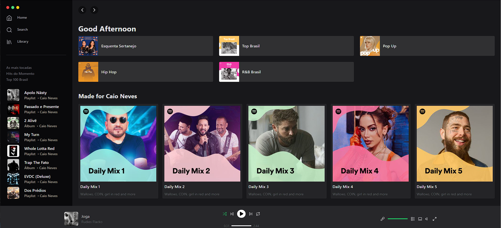

# 🎧🟢 Tailwind Spotify

Exploring the behavior and flexibility of using Tailwind CSS, along with powerful Typescript integration.

This project aims exclusively at studying and improving concepts in front-end development, using the Spotify Desktop model as a reference.
It is important to highlight that this project is an example of low fidelity, containing only static elements and devoid of functionality, serving only as a stylization exercise.

If you want to run it on your machine:

### Install dependencies
`pmpn i` or `npm i`

### Run project

`npm run dev`

